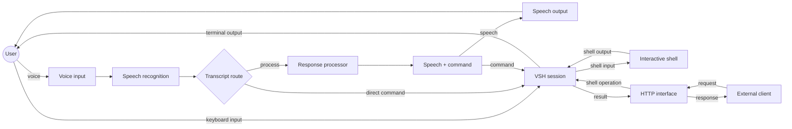

# vsh: Voice Shell

An interactive terminal controlled by voice, with local or cloud speech and AI providers.

## Features

- Control Bash, Zsh, or Fish by voice.
- Use Ollama, OpenAI, Anthropic, or any command-line AI.
- Pick local, cloud, or custom HTTP speech providers.
- Ignore steady background noise before transcription.

## How it works



Keyboard, voice, and HTTP commands all operate on the same live shell session.

## Installation

The Nix package includes its native audio dependencies. For uv installs, install PortAudio; Linux also requires ALSA development libraries.

```bash
# uv
uv tool install git+https://github.com/creator54/vsh.git

# Nix
nix profile install github:creator54/vsh
```

- Local checkout: `uv tool install -e .`

## Usage

- `vsh`: start the shell.
  - `--voice`: start listening immediately.
  - `--verbose`: show logs.
  - `--echo`: return recognized speech without an AI.
  - `--serve --port 8770`: expose the live shell on an authenticated, local-only web server.
- `vsh setup`: configure the shell, speech and AI providers, microphone, and keybind.
- `vsh bind`: change the VSH toggle keybind.
- `vsh stt [--file <audio.wav>]`: transcribe the microphone or a WAV file.
- `vsh tts "<text>" [--save <out.wav>] [--stream]`: speak or save text.

## Voice replies

- Format: `{"speech":"Opening it.","command":"cd ~/project"}`
  - Use `null` when there is no command.
  - Invalid JSON is shown as text and never run.
- Speech comes first.
  - TTS available: play it.
  - TTS off or failed: print it.
- Command comes next.
  - `auto_submit = true`: run it.
  - `auto_submit = false`: leave it editable.

## Environment overrides

- Shell and voice: `VSH_SHELL`, `VSH_VOICE`.
- AI provider: `VSH_LLM`, `VSH_LLM_KEY`.
- Output: `VSH_OUTPUT_MODE` (`speak_and_command`, `command_only`, or `speak_only`).
- Visual: `VSH_OVERLAY` (`auto`, `kitty`, or `none`).
- Voice command: `VSH_VOICE_HANDLER='command {}'`.
- Fish replies: `VSH_RESPONSE_BRIDGE=fish-signal`.
- HTTP bridge: `VSH_SERVER_TOKEN` sets the bearer token for `--serve`.
  - When unset, VSH generates and prints a per-instance token with the bound address.
  - Send it as `Authorization: Bearer <token>` on every bridge request.

## Keybinds

- Press the configured keybind (default `Ctrl+\`), `Ctrl+G`, or `Ctrl+]` to toggle voice capture.
  - Off: remove the voice indicator and restore the normal cursor.
  - On: follow the system microphone's mute state (Linux/PipeWire).
